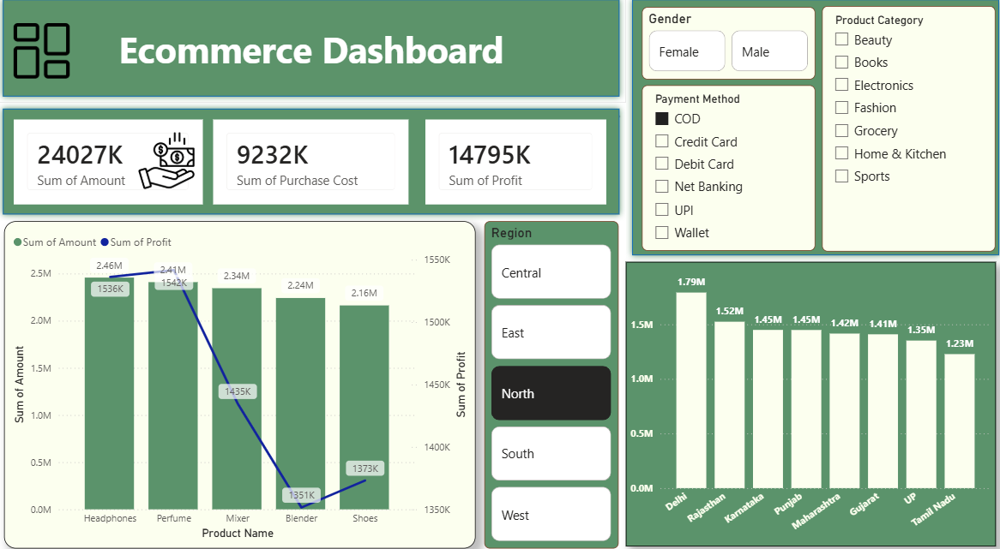

# 🛒 E-Commerce Sales Analysis Dashboard
**Power BI | Advanced Excel | Power Query | DAX**

---

  

## 📌 Project Overview
Built an interactive Power BI dashboard to analyze **$24M in Revenue** and **$14M in Profit**. The project focuses on real-time KPI tracking and regional sales performance.

## 🛠️ Tech Stack & Steps
* **Tools:** Power BI Desktop, Excel, Power Query.
* **ETL:** Cleaned and transformed raw sales data (14+ columns) using Power Query.
* **Modeling:** Established a Star Schema for efficient data retrieval.
* **DAX:** Created custom measures for Profit Margin and Sales Trends.

## 📂 Dataset Columns
`Customer ID` | `Product Category` | `Region` | `State` | `Gender` | `Payment Method` | `Quantity` | `Profit`

## 📊 Dashboard Preview

*(Upload your screenshot as 'dashboard_preview.png' to show it here)*

## 📈 Key Results
* **Top States:** Identified **Delhi and Rajasthan** as highest revenue contributors.
* **Payment Insights:** 45% of users prefer **UPI/Digital** payments.
* **Profitability:** Clothing and Electronics drove the highest margins.

## 🚀 How to Run
1. Clone this repository.
2. Open `E-Commerce_Analysis.pbix` in **Power BI Desktop**.
3. Use Slicers to filter by **Region** or **Category**.

---

## 📫 Connect with me:

---
